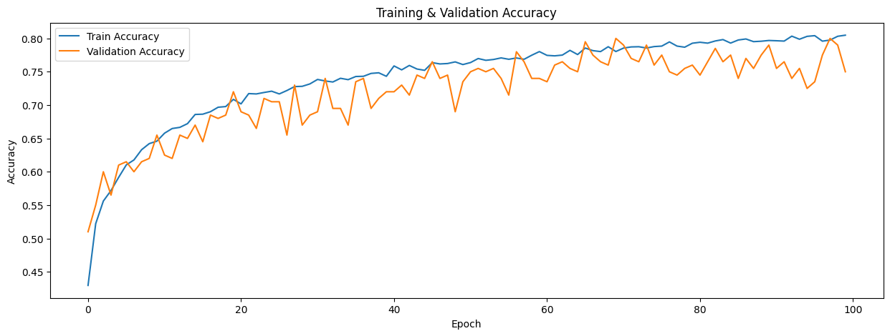
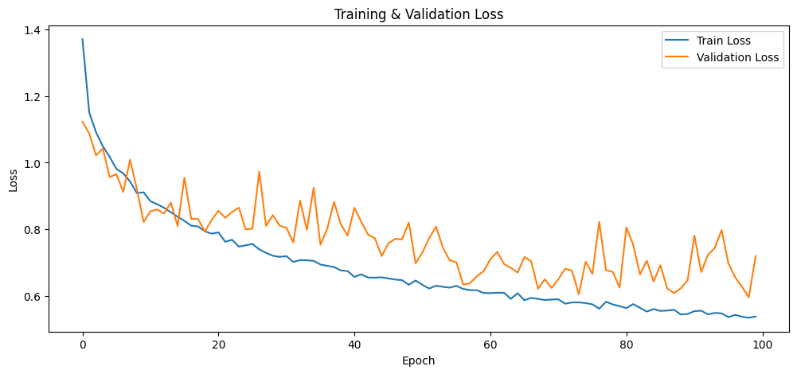
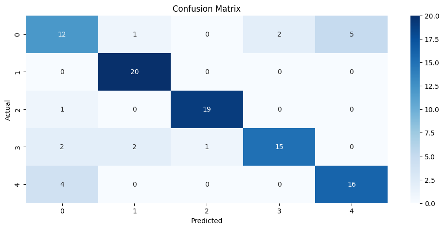

# Fruit Classification 

A fruit image classification project using a Convolutional Neural Network (CNN) to classify images into five fruit categories: Apple, Banana, Grape, Mango, and Strawberry.

## About the Project

This project implements an image classification model using a Convolutional Neural Network (CNN).

The workflow covers:

- Dataset preparation
- Image preprocessing
- Data augmentation
- CNN model development
- Model training
- Model evaluation
- Fruit image prediction

## Objective

The objective of this project is to develop a CNN-based model that can recognize different types of fruits based on their visual features.

## Dataset

The dataset consists of five fruit classes:

- Apple
- Banana
- Grape
- Mango
- Strawberry

The images are resized to **128 × 128 pixels** and divided into training, validation, and testing datasets.

## Model

The project uses a **Convolutional Neural Network (CNN)** consisting of:

- Convolutional layers
- MaxPooling layers
- Flatten layer
- Dense layer
- Dropout
- Softmax output layer

### Training Configuration

| Parameter | Value |
|---|---|
| Image Size | 128 × 128 |
| Optimizer | Adam |
| Learning Rate | 0.0005 |
| Batch Size | 32 |
| Maximum Epochs | 100 |
| Early Stopping | Enabled |

## Results

The trained model was evaluated using the test dataset.

**Test Accuracy: 82%**

**Test Loss: 0.6132**

### Training Accuracy



### Training Loss



### Confusion Matrix



## Project Structure

```text
fruit-classification/
│
├── README.md
├── fruit-classification.ipynb
│
└── assets/
    ├── accuracy.png
    ├── loss.png
    └── confusion-matrix.png
